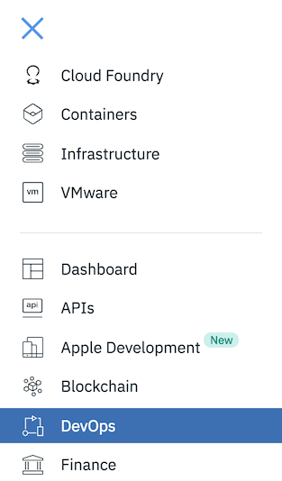
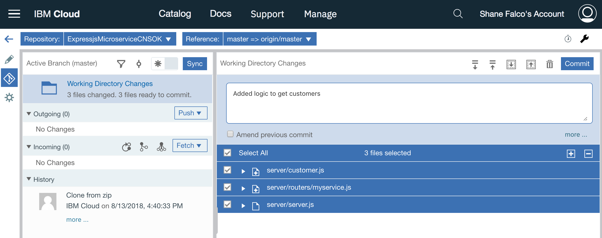
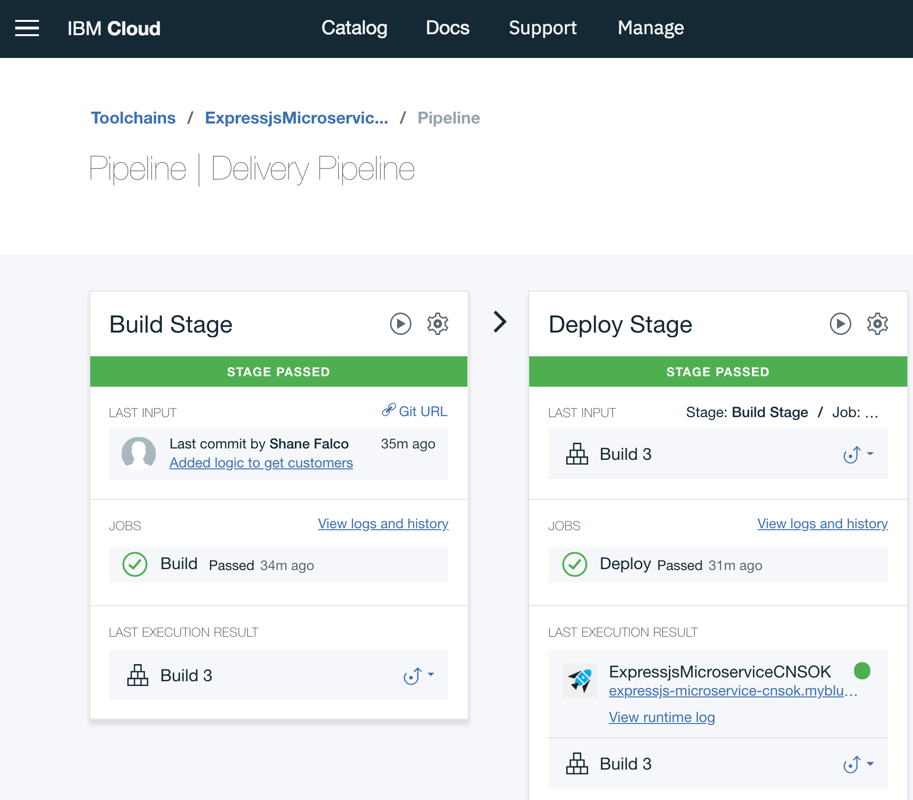
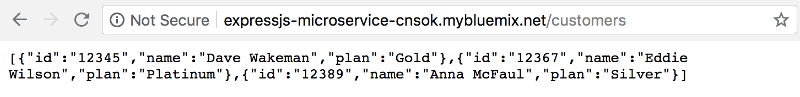
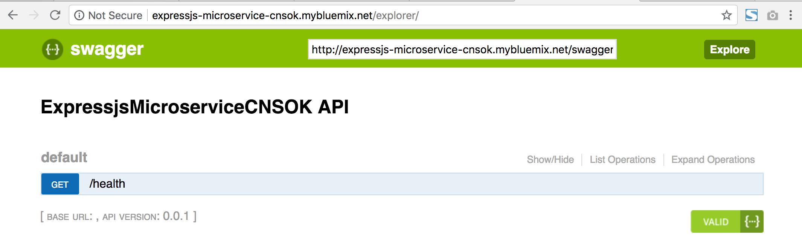
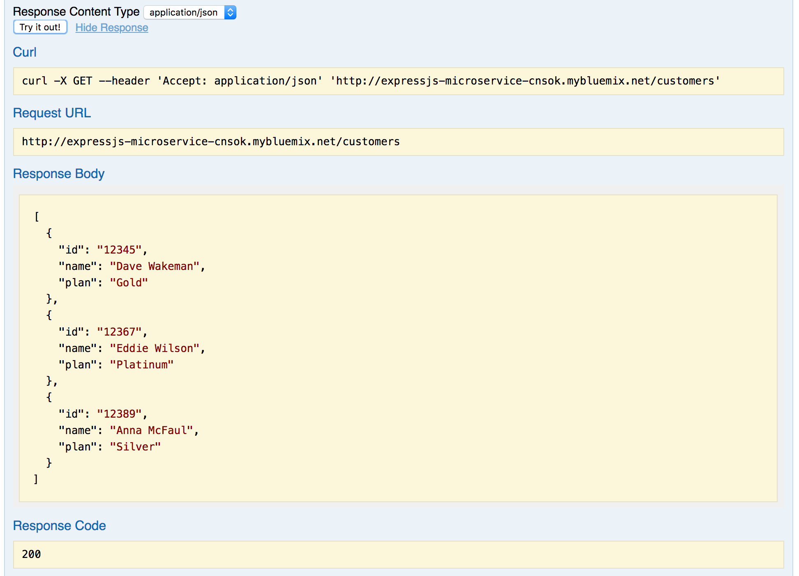

# Building your first microservice in IBM Cloud

In this lab you will create an account on IBM Cloud and provision your first microservice!   You will then add some code to the initial application to start building out your service.  You will use browser-based tools that are part of your application toolchain.  This toolchain is provided via the [Continuous Delivery](https://console.bluemix.net/catalog/services/continuous-delivery) service in IBM Cloud. 

Let's get started!

*__Note:__ Github will open all links in this lab in the current browser window.  If you're using a mac you can `CMD-Click` the link to open it in a new tab or browser.  If you're using Windows `CTRL-Click` the link.*

## Sign up for IBM Cloud

If you have already signed up you can login here:  [https://console.bluemix.net](https://console.bluemix.net)

If you haven't signed up yet go to [https://ibm.biz/cloud_wcp](https://ibm.biz/cloud_wcp) and click the `Sign up` button at the top right.

Fill in the required fields and click the `Create account` button at the bottom.  You will need to provide a password that conforms to the password format policy before you can click the button.


When you have created your account you will see this in the browser:


Now it's time to check your email.  You should have an email from `IBM Cloud` that looks like this.  


Click the `Confirm Account` button.  You should see this in your browser:


Now you have an IBM Cloud Account!!  Click the `Log in` button to login and check it out!  Review the account privacy policies and click the `Proceed` button if you agree.

After you login you will see the `Dashboard` page.  This page can also be accessed at anytime from anywhere in IBM Cloud by clicking on the `IBM Cloud` button on the menubar:


Let's take a quick look at the landing page.


Across the top you will see several filters that you can use to see only the resources you may be interested in.  We will work with them later in the lab.  The IBM Cloud Platform contains a wide variety of resources that can be used to build and run many different types of cloud applications.  They are organized by resource type on the dashboard.

Click on `Catalog` button.


The catalog is where you will find the services and resources that are available to your cloud applications.  Feel free to browse the catalog and learn about some of these services.  When you are done click on `IBM Cloud` on the top menu bar to return to the dashboard.

## Create your first application

The IBM Cloud Platform includes a collection of `Starter Kits` to help you get started with your first application.  We will use one of these starter kits to create and deploy our microservice.

In the middle of the dashboard page there is a section called `Create enterprise-level web apps`.  Click on the `View App Service starter kits` button.


These are the starter kits that are available today.  Scroll down through the list and click on feel free to click on them to learn more.  If you need to get back to this page you can click on the `Starter Kits` link in the left navigation menu.

Scroll down and find the starter kit named Express.js Microservice.


Click on the tile.  This page describes the contents of the starter kit.

Click on the `Create App` button to create the application.  You will need to provide details for your application.  The Details panel contains default information for your app name and host; you can keep them or you can change them if you wish.  If you change either value remember that the hostname must be unique and needs to be a valid hostname, as the host name and domain are what make up your application's URL.


When you are happy with the details click the `Create` button at the top right.  You should see a page similar to the one below.  You have just created your app!!


Right now it's just a definition; we haven't deployed it anywhere yet.  Also, you can see that it doesn't have any of the resources from the catalog added to it yet.  Before we deploy the app let's add one.

Click on the `Add Resource` button.  You will see a dialog with a list of the categories of resources to choose from.  Click on `Data` then click `Next`.


Next you will see a list of available services in the `Data` category.  

*__Note:__ This list may be different from the list of services in the `Data` category in the catalog.  Not all services in the catalog are available for use with an IBM Lite Account.*


Click on `Cloudant` and click Next.  You will be prompted to select the region in which you want to create the resource.  


Make sure you select `US South` as the region and click Next.  You will see messages that your service is being created and will be taken back to your application details page.  You can see that now the service is bound to your application and you will see the service credentials for it.


Now you are ready to deploy your app!

Click on the `Deploy to Cloud` button in the `Deploy your App` tile on the right.


In the dialog that pops up Click the `Cloud Foundry App` tile.  Cloud Foundry organizes resources into `Spaces`; notice that the `space` dropdown has the value of `dev` already selected.  This space was created for you automatically when you created your account.  Your organization got created automatically as well, and your email address was used to name your organization.  You can change this later if you wish.

Click `Create`.

You will see some messages that resources are being allocated and that your toolchain was created successfully.  The App Details page should show that your toolchain is configured.


Click on the `View Toolchain` button.


The Continuous Delivery service in IBM Cloud provides a collection of developer tools that can be linked together into toolchains.  THe toolchain in the screen shot above is a typical starter toolchain that contains tools for you to store your code, track issues, deploy your application and to edit your code right in the browser.  

Click on the `Git` tile.


*__Note:__ You may see some orange banners at the top when you first open your repo.  These are normal, and are warning you that you need to create a Personal Access Token if you want to clone the repo locally to your machine.  We will not be doing that in the lab so you can close those alerts.  Dang, yes we do need to do this, as Orion also requires it*

IBM Cloud provides a built-in instance of Git that you can use to manage your code.  To keep things simple the starter kit uses this internal repository to manage your code, but toolchains support integrations to Github, GitLab, Bitbucket, Rational Team Concert and other tools as well.

----------- Start of temp section - to be removed before lab or updated
We will be cloning this repo later in the lab so we must first set up an access token.  On the top right of the menu bar, click the icon for your user and click `Settings`.

image here

Click the Access Tokens link on the left navigation menu.

image here.


---------- End of temp section

Click the `Back` button on your browser to return to the toolchain.

Click on the `Deliver` tile in the toolchain to see the delivery pipeline for your application.


You can see that the delivery pipeline consists of a Build stage and a Deploy stage.  The build stage for a node.js application that essentially runs the `npm build` command and packages up the directory into a zip file that gets stored internally and passed to the Deploy stage.  The Deploy stage uses the Cloud Foundry CLI to push your application to IBM Cloud.

*__Note:__ You might see that the Deploy stage is still running.  This is okay, just wait for it to finish before proceeding.  If the Deploy stage shows as `Failed` just click the Play button to run it again.*

When the Deploy stage shows that it has passed and your application has a little green dot next to it go ahead and click the URL for your application.

OOPS!  You got a Not Found error, right?  Not to worry, this was expected.  It occurred because we haven't actually add any of our own logic to the app yet, and the code doesn't currently handle the default route.  However, the initial code does include a couple of routes that are used by IBM Cloud to monitor the health of your application.  

In your browser add `/health` to the end of your app URL and hit enter.  You should see some JSON in the browser:

```{"status":"UP"}```

That means your application is up and running!

## Add logic to the application

At this point in the lab you have created your IBM Cloud account, created your first application and deployed it.  You have seen the toolchain that was created for your application and verified that it is up and running.  Now it is time to add the logic for your microservice.  In this section you will create a new function to return a list of customers.

Click the hamburger menu, then click on `DevOps` on the navigation menu that pops up.




This is where you will find all of your application toolchains.  Click on the name of your toolchain to view it. 

Click on the `Eclipse Orion Web IDE` tile.


This is a full feature editing environment that runs in your browser.  When it first loads it clones the git repo much like you would if you were editing code locally.  Starting now you will be working on a "local" copy of your repo, although you don't have to worry about having any git-related tools on your laptop.

The code that you see is the default code that got initially loaded when you created the application.  It is a fully functional application that you can extend with your own code.  For the purposes of this lab you are not expected to know anything about node.js or the code in this application.  The code you need to add and instructions for where to add it will be provided in the lab instructions.

When you first enter the web editor the page you see should look like this:


On the left navigation menu right-click on the `server` folder and choose `New -> File`.  Name the file `customer.js`.

Copy and paste the code below into the file.

```
exports.getCustomers = function(req, res) {

    var customers = [
        {
            id: "12345",
            name: "Dave Wakeman",
            plan: "Gold"
        },
        {
            id: "12367",
            name: "Eddie Wilson",
            plan: "Platinum"
        },
        {
            id: "12389",
            name: "Anna McFaul",
            plan: "Silver"
        }
    ]

    res.json(customers);

}
```

Right click the `routers` directory under the `server` directory and create a new file named `myservice.js`.  Copy and paste the following code into the file.

```
var customer = require('../customer');

module.exports = function(app){

    app.get("/customers", customer.getCustomers);

}
```

Click on the file named `server.js` in the `server` directory.  Copy and paste the line of code below on line 24 after this line of code:

`23 // add your code here`

```
// Add your code here
require('./routers/myservice')(app);
```

Now you have added some code into your microservice and are ready to deploy it.  Remember that you've been working with a local clone of your git repo, so you first need to commit the code in the local git repo.

Click on the icon that looks like a road sign in the left navigation bar:


You can see some files selected in the `Working Directory Changes` pane.  These are the files that you updated.  To commit these changes in the local repo add a comment into the text area and click the blue `Commmit` button.



Once you have committed these changes you will see that there are some changes listed in the Outgoing section.  This is because you have committed these changes to the local repo and they are ready to be "pushed" to the remote repo, which is the repo in IBM Cloud.  

Click the `Push` button to push your changes.


When the push is complete you will see that there are no more outgoing changes, and you should see a new line in the history that shows your commit being pushed.


So now what?  If you remember when the toolchain for your application was built it included a build stage.  That build stage is triggered to fire whenever changes get committed to the git repo in IBM Cloud.  That happened when you pushed your changes in the previous step, so your toolchain's build stage just fired!

CLick on the back arrow icon on the left navigation toolbar to go back to your toolchain.


Click on the Delivery Pipeline tile.

You should see that your Build stage has run again and your Deploy stage is probably still running.


When it finishes your changes are deployed!



Click on the URL for your app in the Last Execution Result box of the Deploy Stage.  We still don't have a default route defined so the browser will show `Not found`.  This is still okay.  The URL for our new route is:

`http://<your-app-route>.mybluemix.net/customers`

Therefore you need to add `/customers` to the end of your URL and hit enter.



You just executed the new code and returned a list of customers!  Your microservice now has a function that returns a list of customers.

## Adding another function to your microservice

So far there is one function in your microservice that returns a list of customers.  Nice work!  But there is more functionality that your microservice needs.  In this section you will perform steps similar to the last section to add a new function that returns a list of plans.

Click on the hamburger menu and click on `DevOps`.  Click on your toolchain, then click on the Orion Web IDE tile.

You should now be back in the web editor.  Right click on the `server` directory and create a new file named `plan.js`.

Copy and paste the code below into the file.

```
exports.getPlans = function(req, res) {

    var plans = [
        {
            id: "abc123",
            name: "Gold",
            description: "This is the Gold plan",
            premium: 328.49
        },
        {
            id: "def456",
            name: "Platinum",
            description: "This is the Platinum plan",
            premium: 428.32
        },
        {
            id: "ghj789",
            name: "Silver",
            description: "This is the Silver plan",
            premium: 287.46
        }
    ]

    res.json(plans);

}
```

Click on `myservice.js` in the left navigation menu to edit it.  You may have to expand the `routers` folder to see it.

Copy and replace *__all__* of the code in the file with the code below.

```
var customer = require('../customer');
var plan = require('../plan');
module.exports = function(app){

    app.get("/customers", customer.getCustomers);
    app.get("/plans", plan.getPlans);
}
```

That's all of the code that needs to be added; now you need to commit and push it.  

Click on the icon that looks like the road sign on the left navigation bar.


You will see that this time there are two files selected.  These are the files you just updated.  Enter a commit message and click the `Commit` button.


Now there should be an outgoing change.  Click the `Push` button to push your changes to the remote git repo in IBM Cloud.  Remember that this triggers your the build stage of your delivery pipeline!


Click the back arrow on the left navigation toolbar to go back to the toolchain.


Click on the Delivery Pipeline tile.  You should see that your deploy stage is still running.  Once it has passed you should be able to click on the URL for your app.  Remember that the default route is missing; this time add `/plans` to your URL and hit enter.


If you got some JSON back in your browser window then your code works!

## Using the API Explorer

Your microservice is essentially a REST API that has two functions defined so far:
```
GET /customers
GET /plans
```
Most REST APIs have an OpenAPI (a.k.a. Swagger) definition and an API Explorer that consumers of the API can use to test their applications.  Well, the initial code that was used to populate your git repo also has a definition file and the API explorer code built into it!

To test it out, go back to your browser where you tested your code in the last section and change the end of the URL from `/plans` to `/explorer`.  It may take a few seconds to load, and when it does you should see something like this:



But where are the two API operations we added in the last two sections?  The reason they are not there yet is because we didn't update the file the contains the API definition.  That's the goal of this section of the lab.

Go back to your toolchain and open the `Eclipse Orion Web IDE`.

Expand the `public` folder and click on `swagger.yaml`.  This is the file that drives the Swagger UI code behind the API Explorer.

*__Note:__ The content of the `swagger.yaml` file is sensitive to indents.  It is very important to make sure your cursor is on column 1 of the line where you want to paste code, and also very important to make sure that when you select the code from this document you start with column 1 of the first line you select.  It is a common mistake to accidentally start selecting text in column 2, especially when that column contains a space!*

Copy the code below and paste it right above line 26 that has `definitions:`

```
  /customers:
    get:
      operationId: getCustomers
      responses:
        200:
          description: "Get all of the customers"
          schema:
            $ref: "#/definitions/CustomersResponse"
  /customers/{customerId}:
    get:
      description: "Returns a single customer"
      operationId: "getByCustomerId"
      parameters:
      - name: "customerId"
        in: "path"
        description: "ID of the customer to return"
        required: true
        type: "string"
      responses:
        200:
          description: "successful operation"
          schema:
            $ref: "#/definitions/Customer"
        400:
          description: "Invalid ID supplied"
        404:
          description: "Customer not found"
  /plans:
    get:
      operationId: getPlans
      responses:
        200:
          description: "Get all of the plans"
          schema:
            $ref: "#/definitions/PlansResponse"
  /plans/{planId}:
    get:
      description: "Returns a single plan"
      operationId: "getByPlanId"
      parameters:
      - name: "planId"
        in: "path"
        description: "ID of the plan to return"
        required: true
        type: "string"
      responses:
        200:
          description: "successful operation"
          schema:
            $ref: "#/definitions/Plan"
        400:
          description: "Invalid ID supplied"
        404:
          description: "Plan not found"
```

Those lines add entries for the new routes we added, `/customers` and `/plans`.  They also include entries for two other paths that would commonly be part of any API.  We won't implement them in this lab.

Next, copy the code below and paste it at the bottom of the file, at the end of the definitions section.  You may need to add a blank line at the end of the file.  Make sure your cursor is on the first column of the last line of the file.  You may need to backspace to get to column 1.  

```
  Customer:
    type: "object"
    properties:
      id:
        type: "string"
      name:
        type: "string"
      plan:
        type: "string"
  Plan:
    type: "object"
    properties:
      id:
        type: "string"
      name:
        type: "string"
      description:
        type: "string"
      premium:
        type: "number"      
  CustomersResponse:
    type: "object"
    properties:
      customers:
        type: "array"
        items:
          $ref: "#/definitions/Customer"
  PlansResponse:
    type: "object"
    properties:
      plans:
        type: "array"
        items:
          $ref: "#/definitions/Plan"
```

Okay, the `swagger.yaml` file has everything you need to add your new operations to the API Explorer.  The final version of the file should look like this:

```
swagger: '2.0'

info:
  version: "0.0.1"
  title: ExpressjsMicroserviceCNSOK API

consumes:
  - text/plain

produces:
  - application/json

paths:
  /health:
    get:
      operationId: get
      description: Get health status of ExpressjsMicroserviceCNSOK 
      responses:
        200:
          description: "Health check response"
          schema:
            $ref: "#/definitions/healthResponse"
          examples:
            application/json: { "status": "UP"}
  /customers:
    get:
      operationId: getCustomers
      responses:
        200:
          description: "Get all of the customers"
          schema:
            $ref: "#/definitions/CustomersResponse"
  /customers/{customerId}:
    get:
      description: "Returns a single customer"
      operationId: "getByCustomerId"
      parameters:
      - name: "customerId"
        in: "path"
        description: "ID of the customer to return"
        required: true
        type: "string"
      responses:
        200:
          description: "successful operation"
          schema:
            $ref: "#/definitions/Customer"
        400:
          description: "Invalid ID supplied"
        404:
          description: "Customer not found"
  /plans:
    get:
      operationId: getPlans
      responses:
        200:
          description: "Get all of the plans"
          schema:
            $ref: "#/definitions/PlansResponse"
  /plans/{planId}:
    get:
      description: "Returns a single plan"
      operationId: "getByPlanId"
      parameters:
      - name: "planId"
        in: "path"
        description: "ID of the plan to return"
        required: true
        type: "string"
      responses:
        200:
          description: "successful operation"
          schema:
            $ref: "#/definitions/Plan"
        400:
          description: "Invalid ID supplied"
        404:
          description: "Plan not found"

definitions:
  healthResponse:
    type: "object"
    properties:
      status:
        type: "string"
  Customer:
    type: "object"
    properties:
      id:
        type: "string"
      name:
        type: "string"
      plan:
        type: "string"
  Plan:
    type: "object"
    properties:
      id:
        type: "string"
      name:
        type: "string"
      description:
        type: "string"
      premium:
        type: "number"      
  CustomersResponse:
    type: "object"
    properties:
      customers:
        type: "array"
        items:
          $ref: "#/definitions/Customer"
  PlansResponse:
    type: "object"
    properties:
      plans:
        type: "array"
        items:
          $ref: "#/definitions/Plan"
```


Commit and push your code.

Go back to the toolchain and view the Deploy stage of the Delivery Pipeline.  When the Deploy stage passes you can go back to the browser tab that has the Swagger UI in it and refresh the page.  If you closed that tab the URL is:

`http://<your-app-route>.mybluemix.net/explorer`

The API explorer should now show your new operations:


Click the blue `GET` button next to `/customers`.

Click `Try it out`.  You should get back some JSON:



Scroll down further and click the blue `GET` button next to `/plans`.  Click `Try it out`.


Now that you have added these operations to the API Explorer consumers of your microservice can use the API explorer to test it out as they use it in their own applications!


## Summary

Congratulations, you've built a microservice application in IBM Cloud!  

In the short time you've been working on this lab you've done a lot:

* created an account on IBM Cloud
* created an application using a starter kit
* added a resource (Cloudant database) to your app (although we didn't actually use it in the code today, stay tuned.  In the future this lab will be updated with an optional section that does!)
* deployed the app to IBM Cloud Cloud Foundry
* used the Web IDE in the toolchain to add logic to the application to create a REST API
* committed and pushed the code to the git repo, which triggered the toolchain to automatically build and redeploy the app with the code changes.
* updated the swagger definition so that your new API operations can be tested using the API Explorer

__Whew, you did a lot!  Thanks for attending today!__


