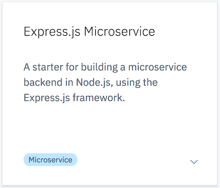

# Building your first microservice in IBM Cloud

In this lab you will create an account on IBM Cloud and provision your first microservice!   You will then add some code to the initial application to start building out your service.  You will use browser-based tools that are part of your application toolchain.  This toolchain is provided via the [Continuous Delivery](https://console.bluemix.net/catalog/services/continuous-delivery) service in IBM Cloud. 

Let's get started!

*__Note:__ Github will open all links in this lab in the current browser window.  If you're using a mac you can `CMD-Click` the link to open it in a new tab or browser.  If you're using Windows `CTRL-Click` the link.*

## Sign up for IBM Cloud

If you have already signed up you can login here:  [https://console.bluemix.net](https://console.bluemix.net)

If you haven't signed up yet go to [https://ibm.biz/cloud_wcp](https://ibm.biz/cloud_wcp) and click the `Sign up` button at the top right.

Fill in the required fields and click the `Create account` button at the bottom.  You will need to provide a password that conforms to the password format policy before you can click the button.


When you have created your account you will see this in the browser:


Now it's time to check your email.  You should have an email from `IBM Cloud` that looks like this.  


Click the `Confirm Account` button.  You should see this in your browser:


Now you have an IBM Cloud Account!!  Click the `Log in` button to login and check it out!  Review the account privacy policies and click the `Proceed` button if you agree.

After you login you will see the `Dashboard` page.  This page can also be accessed at anytime from anywhere in IBM Cloud by clicking on the `IBM Cloud` button on the menubar:


Let's take a quick look at the landing page.


Across the top you will see several filters that you can use to see only the resources you may be interested in.  We will work with them later in the lab.  The IBM Cloud Platform contains a wide variety of resources that can be used to build and run many different types of cloud applications.  They are organized by resource type on the dashboard.

Click on `Catalog` button.


The catalog is where you will find the services and resources that are available to your cloud applications.  Feel free to browse the catalog and learn about some of these services.  When you are done click on `IBM Cloud` on the top menu bar to return to the dashboard.


The IBM Cloud Platform includes a collection of `Starter Kits` to help you get started with your first application.  We will use one of these starter kits to create and deploy our microservice.

In the middle of the dashboard page there is a section called `Create enterprise-level web apps`.  Click on the `View App Service starter kits` button.


These are the starter kits that are available today.  Scroll down through the list and click on feel free to click on them to learn more.  If you need to get back to this page you can click on the `Starter Kits` link in the left navigation menu.

Scroll down and find the starter kit named Express.js Microservice.



Click on the tile.  This page describes the contents of the starter kit.

Click on the `Create App` button to create the application.  You will need to provide details for your application.  The Details panel contains default information for your app name and host; you can keep them or you can change them if you wish.  If you change either value remember that the hostname must be unique and needs to be a valid hostname, as the host name and domain are what make up your application's URL.


When you are happy with the details click the `Create` button at the top right.  You should see a page similar to the one below.  You have just created your app!!


Right now it's just a definition; we haven't deployed it anywhere yet.  Also, you can see that it doesn't have any of the resources from the catalog added to it yet.  Before we deploy the app let's add one.

Click on the `Add Resource` button.  You will see a dialog with a list of the categories of resources to choose from.  Click on `Data` then click `Next`.


Next you will see a list of available services in the `Data` category.  

*__Note:__ This list may be different from the list of services in the `Data` category in the catalog.  Not all services in the catalog are available for use with an IBM Lite Account.*


Click on `Cloudant` and click Next.  You will be prompted to select the region in which you want to create the resource.  


Make sure you select `US South` as the region and click Next.  You will see messages that your service is being created and will be taken back to your application details page.  You can see that now the service is bound to your application and you will see the service credentials for it.


Now you are ready to deploy your app!

Click on the `Deploy to Cloud` button in the `Deploy your App` tile on the right.


In the dialog that pops up Click the `Cloud Foundry App` tile.  Cloud Foundry organizes resources into `Spaces`; notice that the `space` dropdown has the value of `dev` already selected.  This space was created for you automatically when you created your account.  Your organization got created automatically as well, and your email address was used to name your organization.  You can change this later if you wish.

Click `Create`.

You will see some messages that resources are being allocated and that your toolchain was created successfully.  The App Details page should show that your toolchain is configured.


Click on the `View Toolchain` button.


The Continuous Delivery service in IBM Cloud provides a collection of developer tools that can be linked together into toolchains.  THe toolchain in the screen shot above is a typical starter toolchain that contains tools for you to store your code, track issues, deploy your application and to edit your code right in the browser.  

Click on the `Code` tile.


*__Note:__ You may see some orange banners at the top when you first open your repo.  These are normal, and are warning you that you need to create a Personal Access Token if you want to clone the repo locally to your machine.  We will not be doing that in the lab so you can close those alerts.*

IBM Cloud provides a built-in instance of Git that you can use to manage your code.  To keep things simple the starter kit uses this internal repository to manage your code, but toolchains support integrations to Github, GitLab, Bitbucket, Rational Team Concert and other tools as well.

Click the `Back` button on your browser to return to the toolchain.

Click on the `Deliver` tile in the toolchain to see the delivery pipeline for your application.


You can see that the delivery pipeline consists of a Build stage and a Deploy stage.  The build stage for a node.js application that essentially runs the `npm build` command and packages up the directory into a zip file that gets stored internally and passed to the Deploy stage.  The Deploy stage uses the Cloud Foundry CLI to push your application to IBM Cloud.

*__Note:__ You might see that the Deploy stage is still running.  This is okay, just wait for it to finish before proceeding.  If the Deploy stage shows as `Failed` just click the Play button to run it again.*

When the Deploy stage shows that it has passed and your application has a little green dot next to it go ahead and click the URL for your application.

OOPS!  You got a Not Found error, right?  That's because we haven't actually add any of our own logic to the app yet, and the code doesn't currently handle the default route.  However, the initial code does include a couple of routes that are used by IBM Cloud to monitor the health of your application.  

In your browser add `/health` to the end of your app URL and hit enter.  You should see some JSON in the browser:

```{"status":"UP"}```

That means your application is up and running!


