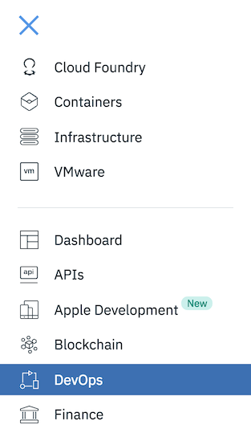
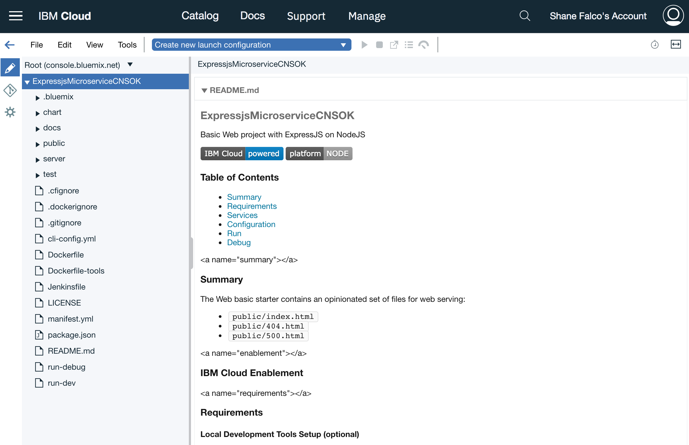
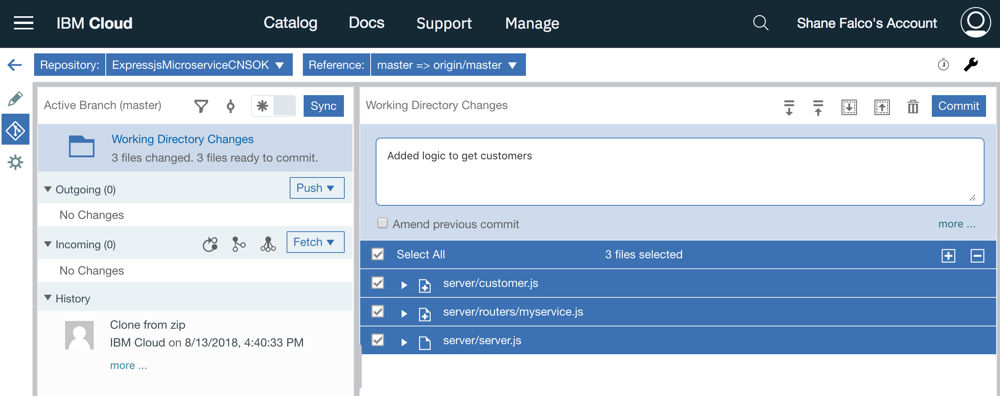
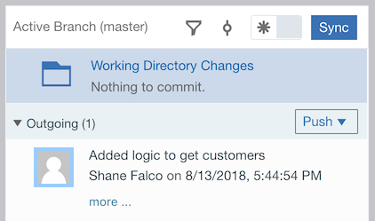
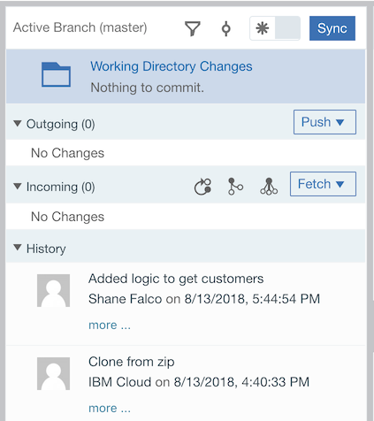
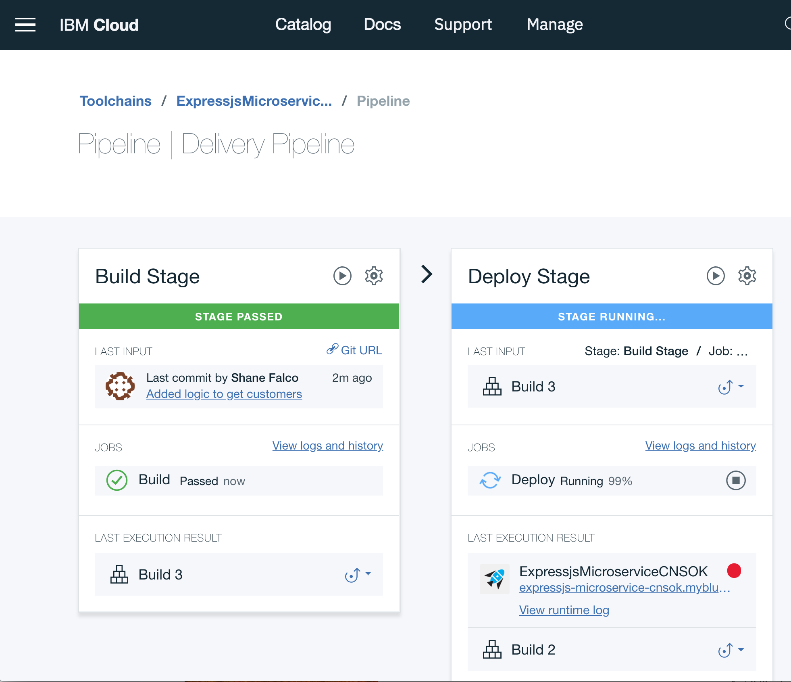
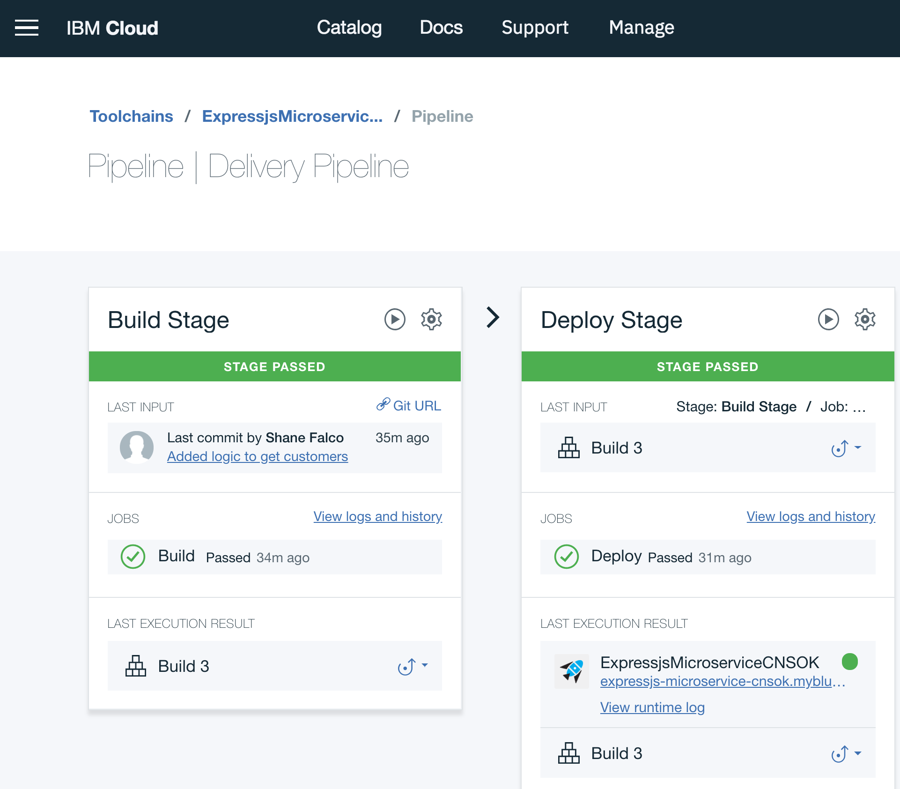
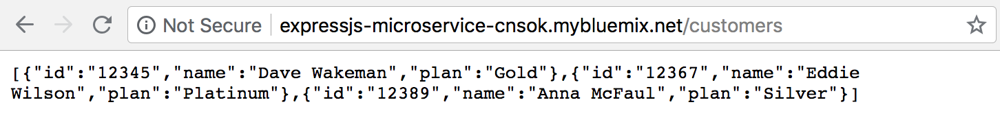

# Add logic to your application

At this point in the lab you have created your IBM Cloud account, created your first application and deployed it.  You have seen the toolchain that was created for your application and verified that it is up and running.  Now it is time to add the logic for your microservice.  In this section you will create a new function to return a list of customers.

Click the hamburger menu, then click on `DevOps` on the navigation menu that pops up.




This is where you will find all of your application toolchains.  Click on the name of your toolchain to view it.

Click on the `Eclipse Orion Web IDE` tile.


This is a full feature editing environment that runs in your browser.  When it first loads it clones the git repo much like you would if you were editing code locally.  Starting now you will be working on a "local" copy of your repo, although you don't have to worry about having any git-related tools on your laptop.

The code that you see is the default code that got initially loaded when you created the application.  It is a fully functional application that you can extend with your own code.  For the purposes of this lab you are not expected to know anything about node.js or the code in this application.  The code you need to add and instructions for where to add it will be provided in the lab instructions.

When you first enter the web editor the page you see should look like this:



On the left navigation menu right-click on the `server` folder and choose `New -> File`.  Name the file `customer.js`.  This file will contain logic that will return a list of three customers.  In a real application this function would retrieve the customers from a database, such as the Cloudant database you added to your application when you created it.  For the purposes of this lab you will just return a hard-coded list of customers.

Copy and paste the code below into the file.

!!! note
    *The Orion Web IDE will automatically save your changes for you.  If for some reason it hasn't saved them and you try to open a differnt file it will warn you that you have unsaved changes.  If this happens you can use the File -> Save menu to manually save your changes.*

```
exports.getCustomers = function(req, res) {

    var customers = [
        {
            id: "12345",
            name: "Dave Wakeman",
            plan: "Gold"
        },
        {
            id: "12367",
            name: "Eddie Wilson",
            plan: "Platinum"
        },
        {
            id: "12389",
            name: "Anna McFaul",
            plan: "Silver"
        }
    ]

    res.json(customers);

}
```

Right click the `routers` directory under the `server` directory and create a new file named `myservice.js`.  The code below creates a `route` for your api and links it to the function you created in `customer.js`.  The new route will be `http://<your-app-name>.mybluemix.net/customers`.

Copy and paste the following code into the file.

```
var customer = require('../customer');

module.exports = function(app){

    app.get("/customers", customer.getCustomers);

}
```

Click on the file named `server.js` in the `server` directory.  Copy and paste the line of code below on line 24 after this line of code:

`23  // add your code here`

```
// Add your code here
require('./routers/myservice')(app);
```

Now you have added some code into your microservice and are ready to deploy it.  Remember that you've been working with a local clone of your git repo, so you first need to commit the code in the local git repo.

Click on the icon that looks like a road sign in the left navigation bar:


You can see some files selected in the `Working Directory Changes` pane.  These are the files that you updated.  To commit these changes in the local repo add a comment into the text area and click the blue `Commmit` button.



Once you have committed these changes you will see that there are some changes listed in the Outgoing section.  This is because you have committed these changes to the local repo and they are ready to be "pushed" to the remote repo, which is the repo in IBM Cloud.  

Click the `Push` button to push your changes.



When the push is complete you will see that there are no more outgoing changes, and you should see a new line in the history that shows your commit being pushed.



So now what?  If you remember when the toolchain for your application was built it included a build stage.  That build stage is triggered to fire whenever changes get committed to the git repo in IBM Cloud.  That happened when you pushed your changes in the previous step, so your toolchain's build stage just fired!

CLick on the back arrow icon on the left navigation toolbar to go back to your toolchain.


Click on the Delivery Pipeline tile.

You should see that your Build stage has run again and your Deploy stage is probably still running.



When it finishes your changes are deployed!



Click on the URL for your app in the Last Execution Result box of the Deploy Stage.  We still don't have a default route defined so the browser will show `Not found`.  This is still okay.  The URL for our new route is:

`http://<your-app-route>.mybluemix.net/customers`

Therefore you need to add `/customers` to the end of your URL and hit enter.



You just executed the new code and returned a list of customers!  Your microservice now has a function that returns a list of customers.