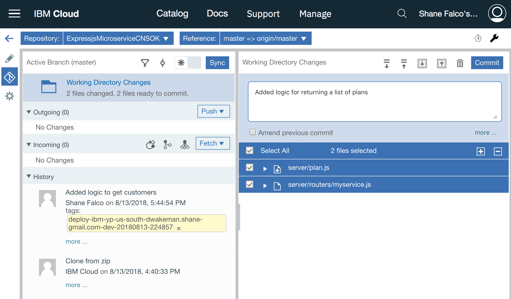
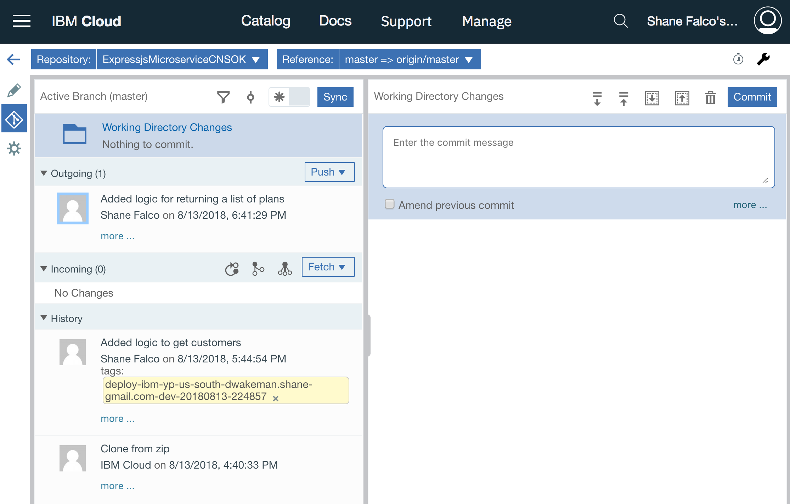
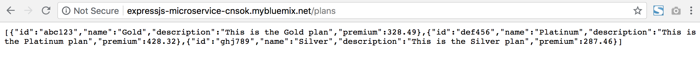

# Add another function

So far there is one function in your microservice that returns a list of customers.  Nice work!  But there is more functionality that your microservice needs.  In this section you will perform steps similar to the last section to add a new function that returns a list of plans.

Click on the hamburger menu and click on `DevOps`.  Click on your toolchain, then click on the Orion Web IDE tile.

You should now be back in the web editor.  Right click on the `server` directory and create a new file named `plan.js`.

Copy and paste the code below into the file.

```
exports.getPlans = function(req, res) {

    var plans = [
        {
            id: "abc123",
            name: "Gold",
            description: "This is the Gold plan",
            premium: 328.49
        },
        {
            id: "def456",
            name: "Platinum",
            description: "This is the Platinum plan",
            premium: 428.32
        },
        {
            id: "ghj789",
            name: "Silver",
            description: "This is the Silver plan",
            premium: 287.46
        }
    ]

    res.json(plans);

}
```

Click on `myservice.js` in the left navigation menu to edit it.  You may have to expand the `routers` folder to see it.

Copy and replace *__all__* of the code in the file with the code below.

```
var customer = require('../customer');
var plan = require('../plan');
module.exports = function(app){

    app.get("/customers", customer.getCustomers);
    app.get("/plans", plan.getPlans);
}
```

That's all of the code that needs to be added; now you need to commit and push it.  

Click on the icon that looks like the road sign on the left navigation bar.


You will see that this time there are two files selected.  These are the files you just updated.  Enter a commit message and click the `Commit` button.



Now there should be an outgoing change.  Click the `Push` button to push your changes to the remote git repo in IBM Cloud.  Remember that this triggers your the build stage of your delivery pipeline!



Click the back arrow on the left navigation toolbar to go back to the toolchain.


Click on the Delivery Pipeline tile.  You should see that your deploy stage is still running.  Once it has passed you should be able to click on the URL for your app.  Remember that the default route is missing; this time add `/plans` to your URL and hit enter.



If you got some JSON back in your browser window then your code works!
