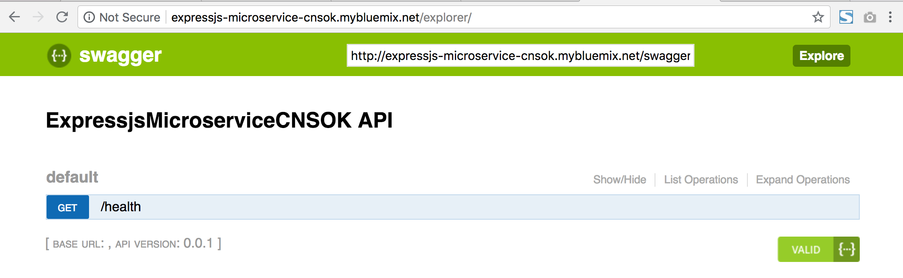
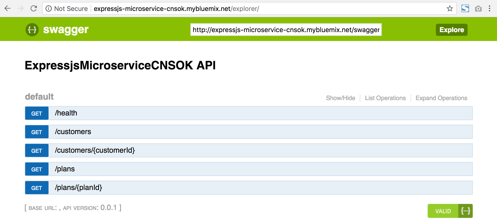
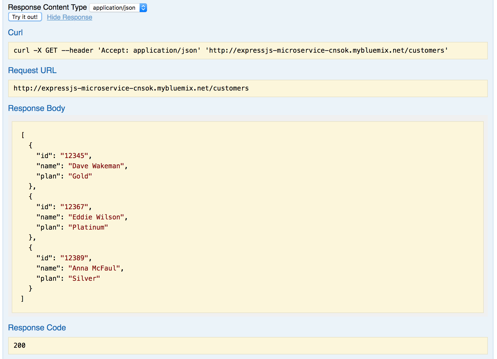
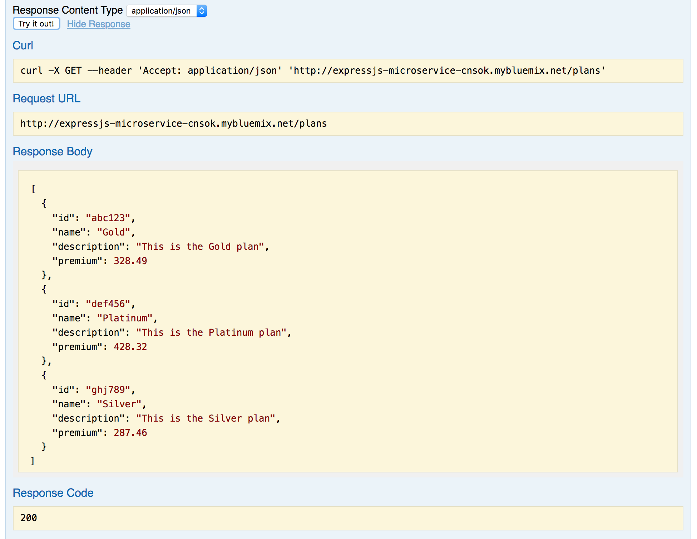

# Using the API Explorer

Your microservice is essentially a REST API that has two functions defined so far:

```
GET /customers
GET /plans
```
Most REST APIs have an OpenAPI (a.k.a. Swagger) definition and an API Explorer that consumers of the API can use to test their applications.  Well, the initial code that was used to populate your git repo also has a definition file and the API explorer code built into it!

To test it out, go back to your browser where you tested your code in the last section and change the end of the URL from `/plans` to `/explorer`.  It may take a few seconds to load, and when it does you should see something like this:



But where are the two API operations we added in the last two sections?  The reason they are not there yet is because we didn't update the file the contains the API definition.  That's the goal of this section of the lab.

Go back to your toolchain and open the `Eclipse Orion Web IDE`.

Expand the `public` folder and click on `swagger.yaml`.  This is the file that drives the Swagger UI code behind the API Explorer.

!!! note
    *The content of the `swagger.yaml` file is sensitive to indents.  It is very important to make sure your cursor is on column 1 of the line where you want to paste code, and also very important to make sure that when you select the code from this document you start with column 1 of the first line you select.  It is a common mistake to accidentally start selecting text in column 2, especially when that column contains a space!*

Copy the code below and paste it right above line 26 that has `definitions:`

```
  /customers:
    get:
      operationId: getCustomers
      responses:
        200:
          description: "Get all of the customers"
          schema:
            $ref: "#/definitions/CustomersResponse"
  /customers/{customerId}:
    get:
      description: "Returns a single customer"
      operationId: "getByCustomerId"
      parameters:
      - name: "customerId"
        in: "path"
        description: "ID of the customer to return"
        required: true
        type: "string"
      responses:
        200:
          description: "successful operation"
          schema:
            $ref: "#/definitions/Customer"
        400:
          description: "Invalid ID supplied"
        404:
          description: "Customer not found"
  /plans:
    get:
      operationId: getPlans
      responses:
        200:
          description: "Get all of the plans"
          schema:
            $ref: "#/definitions/PlansResponse"
  /plans/{planId}:
    get:
      description: "Returns a single plan"
      operationId: "getByPlanId"
      parameters:
      - name: "planId"
        in: "path"
        description: "ID of the plan to return"
        required: true
        type: "string"
      responses:
        200:
          description: "successful operation"
          schema:
            $ref: "#/definitions/Plan"
        400:
          description: "Invalid ID supplied"
        404:
          description: "Plan not found"
```

Those lines add entries for the new routes we added, `/customers` and `/plans`.  They also include entries for two other paths that would commonly be part of any API.  We won't implement them in this lab.

Next, copy the code below and paste it at the bottom of the file, at the end of the definitions section.  You may need to add a blank line at the end of the file.  Make sure your cursor is on the first column of the last line of the file.  You may need to backspace to get to column 1.  

```
  Customer:
    type: "object"
    properties:
      id:
        type: "string"
      name:
        type: "string"
      plan:
        type: "string"
  Plan:
    type: "object"
    properties:
      id:
        type: "string"
      name:
        type: "string"
      description:
        type: "string"
      premium:
        type: "number"      
  CustomersResponse:
    type: "object"
    properties:
      customers:
        type: "array"
        items:
          $ref: "#/definitions/Customer"
  PlansResponse:
    type: "object"
    properties:
      plans:
        type: "array"
        items:
          $ref: "#/definitions/Plan"
```

Okay, the `swagger.yaml` file has everything you need to add your new operations to the API Explorer.  The final version of the file should look like this:

```
swagger: '2.0'

info:
  version: "0.0.1"
  title: ExpressjsMicroserviceCNSOK API

consumes:
  - text/plain

produces:
  - application/json

paths:
  /health:
    get:
      operationId: get
      description: Get health status of ExpressjsMicroserviceCNSOK
      responses:
        200:
          description: "Health check response"
          schema:
            $ref: "#/definitions/healthResponse"
          examples:
            application/json: { "status": "UP"}
  /customers:
    get:
      operationId: getCustomers
      responses:
        200:
          description: "Get all of the customers"
          schema:
            $ref: "#/definitions/CustomersResponse"
  /customers/{customerId}:
    get:
      description: "Returns a single customer"
      operationId: "getByCustomerId"
      parameters:
      - name: "customerId"
        in: "path"
        description: "ID of the customer to return"
        required: true
        type: "string"
      responses:
        200:
          description: "successful operation"
          schema:
            $ref: "#/definitions/Customer"
        400:
          description: "Invalid ID supplied"
        404:
          description: "Customer not found"
  /plans:
    get:
      operationId: getPlans
      responses:
        200:
          description: "Get all of the plans"
          schema:
            $ref: "#/definitions/PlansResponse"
  /plans/{planId}:
    get:
      description: "Returns a single plan"
      operationId: "getByPlanId"
      parameters:
      - name: "planId"
        in: "path"
        description: "ID of the plan to return"
        required: true
        type: "string"
      responses:
        200:
          description: "successful operation"
          schema:
            $ref: "#/definitions/Plan"
        400:
          description: "Invalid ID supplied"
        404:
          description: "Plan not found"

definitions:
  healthResponse:
    type: "object"
    properties:
      status:
        type: "string"
  Customer:
    type: "object"
    properties:
      id:
        type: "string"
      name:
        type: "string"
      plan:
        type: "string"
  Plan:
    type: "object"
    properties:
      id:
        type: "string"
      name:
        type: "string"
      description:
        type: "string"
      premium:
        type: "number"      
  CustomersResponse:
    type: "object"
    properties:
      customers:
        type: "array"
        items:
          $ref: "#/definitions/Customer"
  PlansResponse:
    type: "object"
    properties:
      plans:
        type: "array"
        items:
          $ref: "#/definitions/Plan"
```


Commit and push your code.

Go back to the toolchain and view the Deploy stage of the Delivery Pipeline.  When the Deploy stage passes you can go back to the browser tab that has the Swagger UI in it and refresh the page.  If you closed that tab the URL is:

`http://<your-app-route>.mybluemix.net/explorer`

The API explorer should now show your new operations:



Click the blue `GET` button next to `/customers`.

Click `Try it out`.  You should get back some JSON:



Scroll down further and click the blue `GET` button next to `/plans`.  Click `Try it out`.



Now that you have added these operations to the API Explorer consumers of your microservice can use the API explorer to test it out as they use it in their own applications!