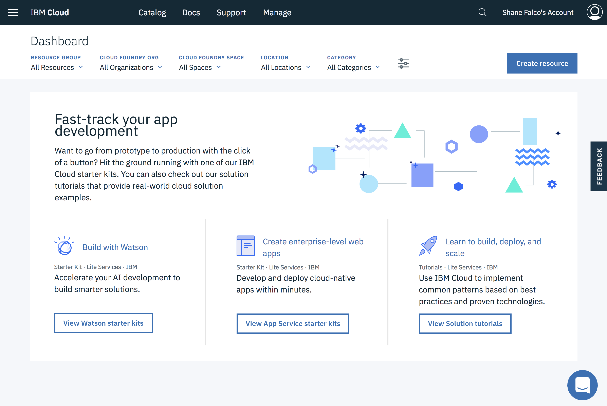
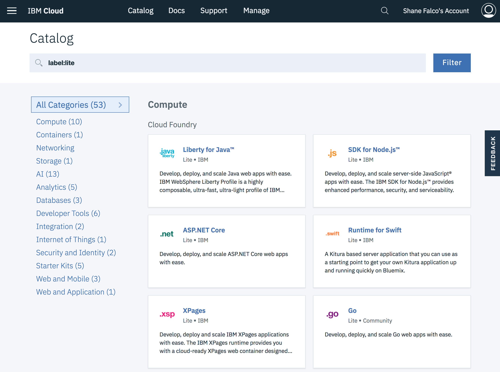

# Explore IBM Cloud

After you login you will see the `Dashboard` page.  This page can also be accessed at anytime from anywhere in IBM Cloud by clicking on the `IBM Cloud` button on the menubar:

Let's take a quick look at the landing page.

Across the top you will see several filters that you can use to see only the resources you may be interested in.  We will work with them later in the lab.  The IBM Cloud Platform contains a wide variety of resources that can be used to build and run many different types of cloud applications.  They are organized by resource type on the dashboard.

Click on `Catalog` button.

The catalog is where you will find the services and resources that are available to your cloud applications.  Feel free to browse the catalog and learn about some of these services.  When you are done click on `IBM Cloud` on the top menu bar to return to the dashboard.