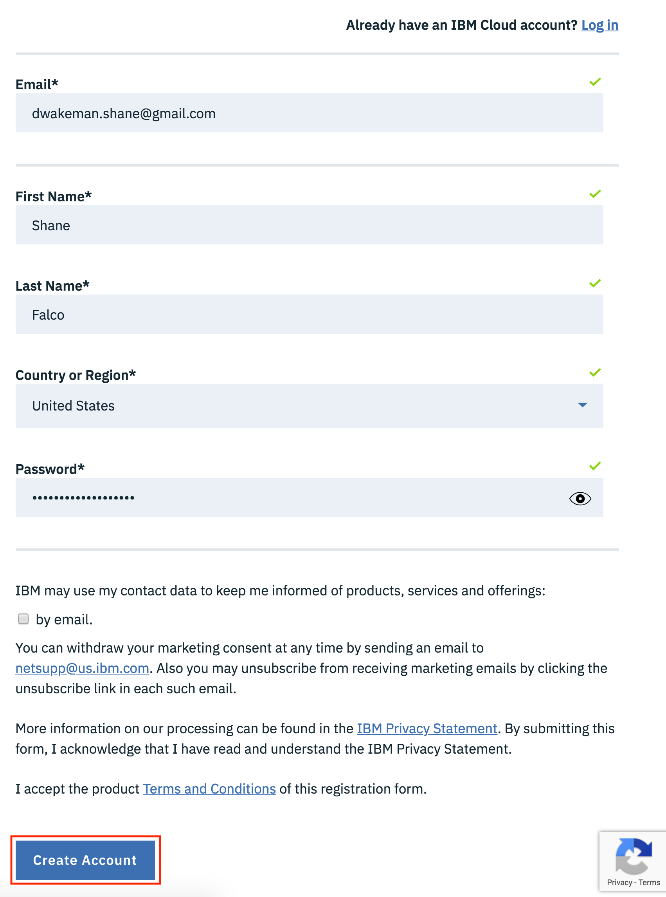
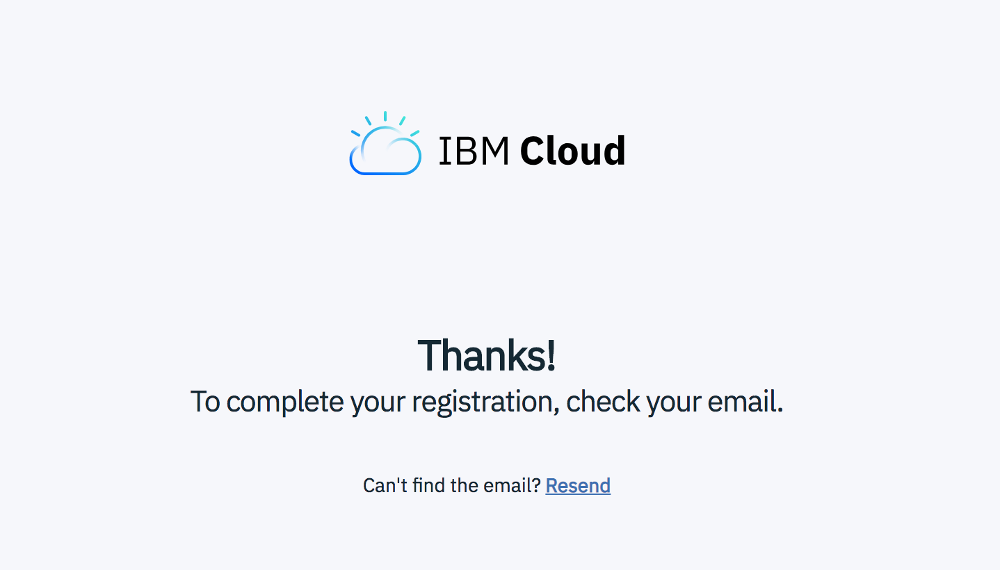
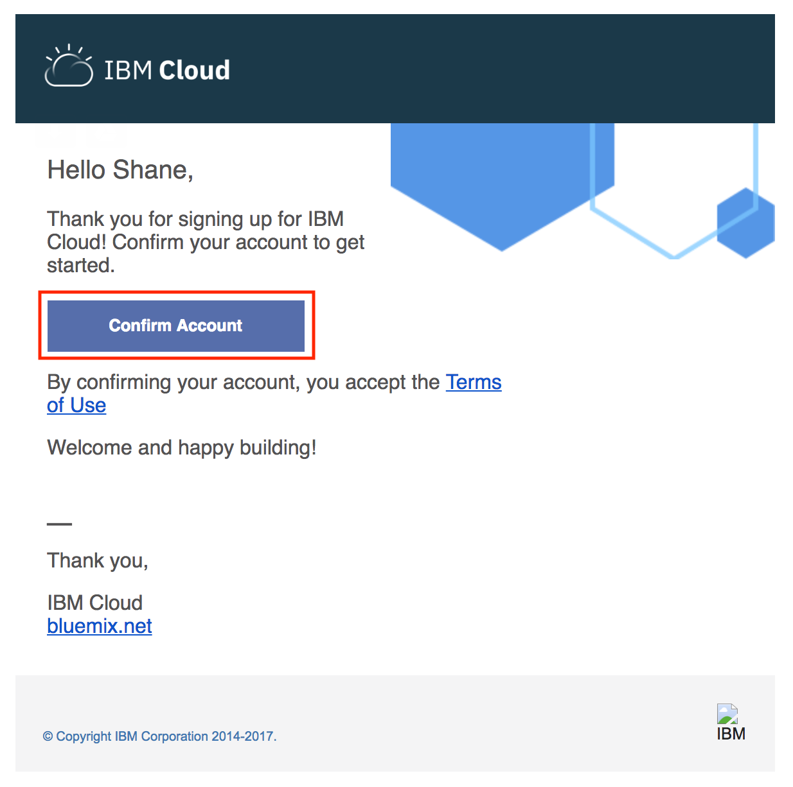
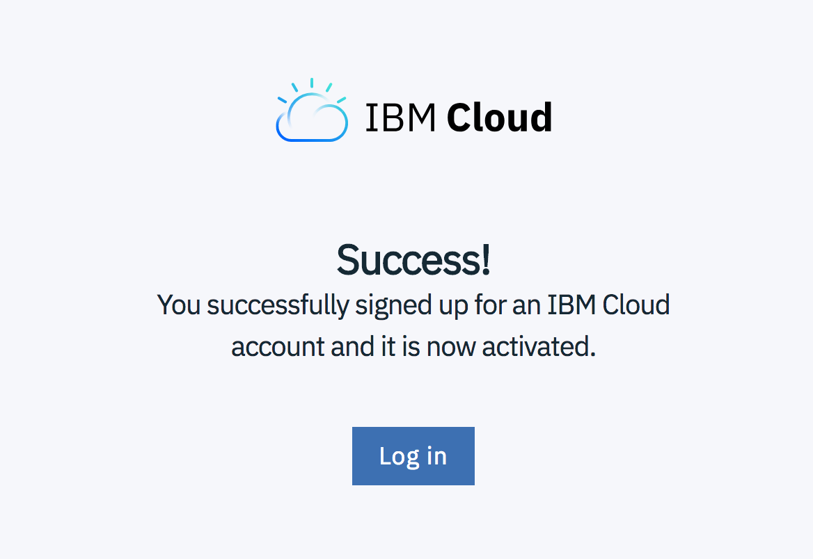

# Sign up for IBM Cloud

To sign up for IBM Cloud go to [https://ibm.biz/cloud_wcp](https://ibm.biz/cloud_wcp) and click the `Sign up` button at the top right.  

!!! note
    *If you already have an IBM Cloud account you can click the `log in` link on the sign up page to login, then proceed to the next section, `Exploring IBM Cloud`.*

To create your account fill in the required fields and click the `Create account` button at the bottom.  You will need to provide a password that conforms to the password format policy before you can click the button.

When you have created your account you will see this in the browser:

Now it's time to check your email.  You should have an email from `IBM Cloud` that looks like this.  

Click the `Confirm Account` button.  You should see this in your browser:

Now you have an IBM Cloud Account!!  Click the `Log in` button to login and check it out!  Review the account privacy policies and click the `Proceed` button if you agree.